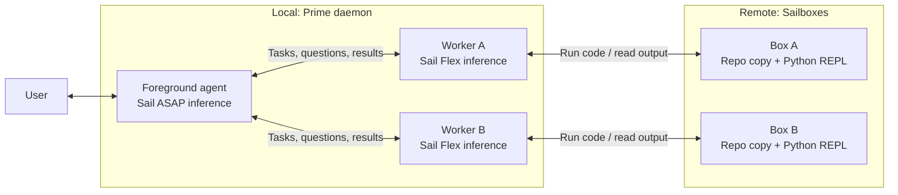

# Prime Agent + SAIL

Background agents on [Sail](https://docs.sailresearch.com), built as a fork of [Prime Agent](https://github.com/PrimeIntellect-ai/prime-agent).

At a high level, the goal is to have one _foreground_ agent which the user converses with, responsible for managing _background_ agents - which are responsible for implementation (eg PRs).

The background agents:

- run with flex inference (to save costs, since at ~sufficient throughput, one agent's latency is not going to block user time - ie latency hiding)
- run with their own copy of the project, in a SAIL box
  - boxes sleep when idle, and wake up with their state when messaged

The foreground agent:
- manages the bg agents: can read their state and msg them / receive msgs
- maintains a project state through markdown files, tracking user intent / project scope / work done etc - which is then shared w the bg agents
- runs on ASAP (interactive)

## How it works

- `rlm.dispatch()` - new RLM primitive that starts a background worker in its own SAIL box and sets up a repo copy.



- **Remote work:** `rlm.dispatch()` gives a worker its own Sailbox and project copy, while reusing Prime's agent messaging and lifecycle. Agent controllers stay in the local daemon; Python, shell commands and file operations run remotely. A worker's `rlm.spawn()` children share its box and checkout, with separate REPLs.
- **Shared context:** the foreground maintains `PROJECT.md` and detailed notes in `project/`, stored with its session. Workers receive relevant context and report findings; the foreground updates the notes and relays changes in user direction.
- **Background lifetime:** workers continue after the terminal closes, provided the local daemon stays running. Idle workers save serializable Python state and their boxes can sleep; follow-up messages resume them.

### What gets copied

```text
/workspace/
├── repo/     tracked files (incl uncommitted edits) + untracked files that aren't gitignored,
│             + HEAD's history (no .git config or hooks), on branch dispatch/<uuid>
└── inputs/
    ├── prime_project/   PROJECT.md + project/ - a snapshot of the foreground's project notes
    └── <name>/          anything passed as inputs={'<name>': 'path'}
/opt/prime-dispatch/   Prime's Python runtime + skills
```

## Try it

```bash
export SAIL_API_KEY=...
./install-local.sh
export PATH="$HOME/.local/bin:$PATH"

cd /path/to/project
agent-projects
```

Needs macOS or Linux and Node 22.8+.
